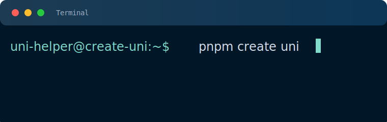
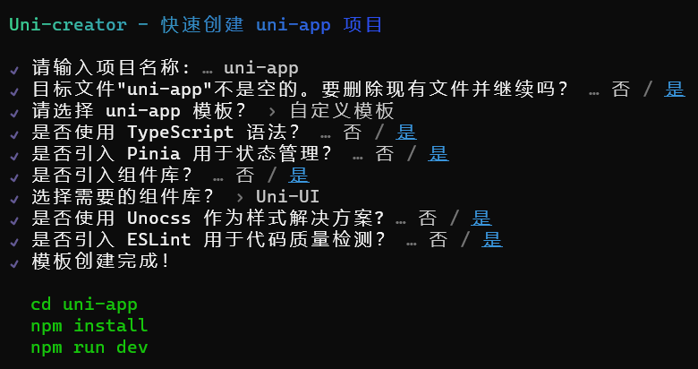

<a href="https://github.com/uni-helper/create-uni/stargazers"></a>
<a href="https://www.npmjs.com/package/create-uni"></a>
<a href="https://www.npmjs.com/package/create-uni"></a>

<br />

# 📦 使用

```shell
# npm
    npm create uni@latest

# yarn
    yarn create uni

# pnpm
    pnpm create uni
```

> [!IMPORTANT]
> 建议添加上标记名（@latest），否则 npm 可能会解析到缓存的过时软件包版本。
>
<!--  -->

## 📖 介绍

`create-uni` 是一个用于快速创建 uni-app 项目的轻量脚手架工具，它可以帮助你快速创建一个基于`vite`和`vue3`的`uni-app`项目，同时提供了一些模板供你选择。

<p align="center"></p>

## 🚤 快速使用

```shell
pnpm create uni --gui
```

```shell
pnpm create uni <项目名称> --ts -m pinia -m uniUse -u ano -e
```

```shell
npx @create-uni/info@latest
# --info  获取当前项目环境信息
```

### 参数说明

| 配置项 | 参数 | 别名 | 可选值 |
|  :---: | :---: | :---: | :---: |
| Template | —— | t | 见[模板列表](#模板列表) |
| TypeScript | ts | —— | —— |
| Plugin | pluginList | p | 见[插件列表](#插件列表) |
| Module | moduleList | m | 见[模块列表](#模块列表) |
| UI | ui | u | 见[组件列表](#组件列表) |
| Eslint | eslint | e | —— |
| gui | gui | —— | —— |
| info | info | —— | —— |

#### 📦模板列表

| 模板名 | 描述 | 参数名 |
| :---: | :---: | :---: |
| [vitesse-uni-app](https://github.com/uni-helper/vitesse-uni-app) | 由 Vite & uni-app 驱动的跨端快速启动模板 | vitesse |
| [wot-starter](https://github.com/wot-ui/wot-starter) | 基于 vitesse-uni-app 的 wot-ui 快速起手模板 | wot-starter |
| [wot-starter-retail](https://github.com/wot-ui/wot-starter-retail) | 基于 wot-ui 的 uni-app 零售行业模板 | wot-starter-retail |
| [uview-pro-starter](https://github.com/anyup/uView-Pro-Starter) | 基于 vitesse-uni-app 的 uView Pro 快速启动模板 | uview-pro-starter |
| [uview-pro-demo](https://github.com/anyup/uView-Pro) | 基于 uView Pro 的完整组件演示模板 | uview-pro-demo |
| [unisave](https://github.com/sunpm/unisave) | 拥抱 web 开发，拯救 uniapp。适配所有 (app、mp、web) 平台 | unisave |
| [tmui 3.2](https://tmui.design) | 优质 Vue3 TS Pinia Vite 跨端组件库 | tmui32 |

#### 📦插件列表

| 插件名 | 描述 | 参数名 |
| :---: | :---: | :---: |
| [vite-plugin-uni-components](https://github.com/uni-helper/vite-plugin-uni-components) | 按需自动引入组件 | import |
| [vite-plugin-uni-pages](https://github.com/uni-helper/vite-plugin-uni-pages) | 提供基于文件系统的路由 | pages |
| [vite-plugin-uni-layouts](https://github.com/uni-helper/vite-plugin-uni-layouts) | 提供类 nuxt 的 layouts 系统 | layouts |
| [vite-plugin-uni-manifest](https://github.com/uni-helper/vite-plugin-uni-manifest) | 自动生成 manifest.json 文件 | manifest |
| [vite-plugin-uni-platform](https://github.com/uni-helper/vite-plugin-uni-platform) | 基于文件名 (*.<h5\|mp-weixin\|app>.*) 的按平台编译插件 | filePlatform |
| [uni-ku-root](https://github.com/uni-ku/root) | 模拟虚拟根组件 (支持 SFC 的 App.vue) | root |
| [vite-plugin-component-placeholder](https://github.com/chouchouji/vite-plugin-component-placeholder) | 占位组件的原生实现 | componentPlaceholder |

#### 📦模块列表

| 模块名 | 描述 | 参数名 |
| :---: | :---: | :---: |
| [pinia](https://github.com/vuejs/pinia) | 符合直觉的 Vue.js 状态管理库 | pinia |
| [unocss](https://github.com/antfu/unocss) | 即时按需的原子级 CSS 引擎 | unocss |
| [uni-network](https://github.com/uni-helper/uni-network) | 为 uni-app 打造的基于 Promise 的网络请求库 | uniNetwork |
| [uni-use](https://github.com/uni-helper/uni-use) | uni-app 组合式工具集 | uniUse |
| [uni-promises](https://github.com/uni-helper/uni-promises) | 为 uni-app 提供的 Promise 包装器 | uniPromises |
| [uni-echarts](https://uni-echarts.xiaohe.ink) | 适用于 uni-app 的 Apache ECharts 组件 | uniEcharts |
| [z-paging](https://github.com/SmileZXLee/uni-z-paging) | 高性能、全平台兼容的 uni-app 分页组件 | zPaging |

#### 📦组件列表

| 组件名 | 描述 | 参数名 |
| :---: | :---: | :---: |
| [uni-ui](https://uniapp.dcloud.net.cn/component/uniui/uni-ui.html) | UniApp 官方组件库 | uni |
| [wot-ui](https://wot-ui.cn/) | 高颜值、轻量化的 uni-app 组件库 | wot |
| [uView-Pro](https://uviewpro.cn/) | 全面支持 Vue3.0、TypeScript 的 uni-app 生态框架 | uview-pro |
| [nutui-uniapp](https://uniapp-nutui.tech/) | 京东风格的轻量级移动端组件库 | nut |
| [skiyee-ui](https://skiyee-ui.netlify.app/) | 随心创造差异化 | skiyee |
| [uv-ui](https://www.uvui.cn/components/intro.html) | 多平台快速开发的 UI 框架 | uv |
| [ano-ui](https://ano-ui.netlify.app/) | 轻量级、漂亮、快速的 UnoCSS 组件库 | ano |

## 🤝 参与贡献

- 提交新功能
- 反馈/解决[`issues`](https://github.com/uni-helper/create-uni/issues)
- 提交新[`模板`](./packages/config/src/template.data.ts)/[`插件`](./packages/config/src/plugin.data.ts)/[`模块`](./packages/config/src/module.data.ts)/[`组件库`](./packages/config/src/ui.data.ts)

## 🛠️ 开发
- Node.js 版本 20+
- Rust 版本 1.64+
- 必须使用`pnpm`作为包管理工具
- `Clone`此仓库
- `pnpm i`安装依赖
- `pnpm dev`运行
- 可本地执行`pnpm create-uni`测试

## 🌸 感谢

项目灵感及部分代码来自 [create-vue](https://github.com/vuejs/create-vue)

## 📄 License

[MIT LICENSE](./LICENSE)

## 🙇🏻‍♂️[赞助](https://afdian.com/a/flippedround)

<p align="center">
  <a href="https://afdian.com/a/flippedround">
    
  </a>
</p>
